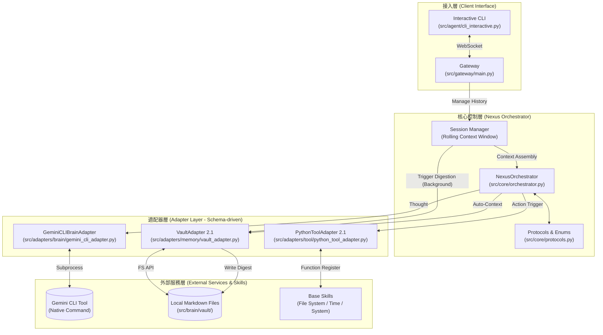

# Nexus 系統架構報告 (v3.2 - Persistent & Resilient Memory)

本文件描述了 Nexus 最新 (v3.2) 的實作架構，特別強調了「長期記憶的新陳代謝」機制。

## 📊 當前系統架構圖 (2026-04-21)

## 🔍 架構關鍵特徵

### 1. 記憶新陳代謝 (Memory Metabolism)
*   **會話滾動 (Rolling Window)**：Gateway 自動管理 Context 長度，防止 Token 爆炸。
*   **非同步消化 (Async Digestion)**：當對話累積到一定程度時，Orchestrator 會在背景發起「摘要任務」，將即時對話轉化為長期記憶條目 (`memory.md`)。

### 2. 主動上下文拼裝 (Auto-Context)
*   大腦在開口前就已經預載了 `soul.md`、`user.md` 與近期 `memory.md` 片段。
*   具備 **降級機制 (Graceful Degradation)**，當檔案讀取失敗時會自動提供「預設性格」。

### 3. 工具適配 2.1
*   具備自動推導 Schema 的能力，讓大腦能在 Prompt 中看到每個工具的用途與參數規範。
