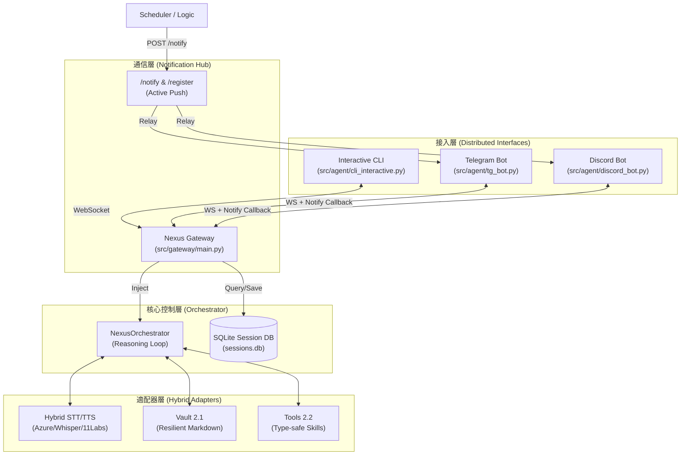

# Nexus 系統架構報告 (v4.3 - Distributed Presence)

本文件描述了 Nexus 最新 (v4.3) 的實作架構，重點在於多平台支援、持久化會話與主動通知能力。

## 📊 當前系統架構圖 (2026-04-21)

## 🔍 架構關鍵特徵 (v4.3)

### 1. 多平台會話同步 (Cross-platform Persistence)
*   採用 **SQLite (`sessions.db`)** 作為對話歷史的中樞。
*   不同的入口 (CLI, TG, Discord) 共享同一個會話識別碼。用戶在 CLI 斷開後，在 TG 能銜接上之前的語境。

### 2. 全時通知中心 (Notification Hub)
*   **平台註冊機制**：每個機器人啟動時會向 Gateway 註冊其接收推送的位址。
*   **離線推送**：即使 WebSocket 斷開，核心仍能透過 `/notify` 接口主動找到用戶所在的平台發送緊急訊息。

### 3. 語音鏡像處理 (Sensory Mirroring)
*   機器人自動感知輸入媒介。語音輸入觸發「文字+語音」回覆；文字輸入觸發「純文字」回覆。

### 4. 系統健壯性 (Resilience)
*   維持自動 Git 快照、錯誤沙盒與垃圾自動清理邏輯。
