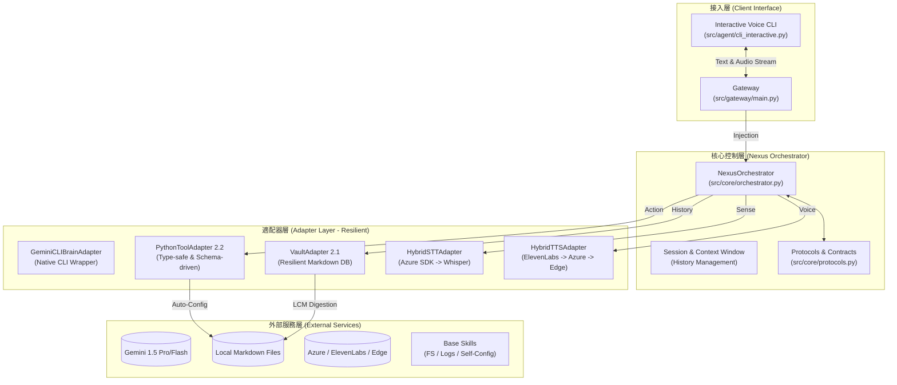

# Nexus 系統架構報告 (v3.5 - Full Sensory SOA)

本文件描述了 Nexus 最新 (v3.5) 的實作架構。目前系統已達成「全感官整合」與「自主配置」的完整閉環。

## 📊 當前系統架構圖 (2026-04-21)

## 🔍 架構關鍵特徵

### 1. 多層降級感官 (Hybrid Sensory Tiers)
*   **STT (聽力)**: Azure SDK (雲端) 優先 -> Whisper (本地) 保底。
*   **TTS (說話)**: ElevenLabs -> Azure -> Edge-TTS (免費高品質)。
*   這確保了系統在無網路或無預算的情況下，依然能維持基礎的互動能力。

### 2. 工業級工具鏈 (Toolbox 2.2)
*   **強型別校驗**: 使用 Pydantic 在執行前驗證 LLM 傳入的參數。
*   **自我修正**: 當參數錯誤時，適配器會提供清晰的錯誤說明，引導大腦自動修正指令。

### 3. 自我配置能力 (Self-Configuring)
*   Nexus 具備受控的 `.env` 寫入權限。用戶可以直接對話設定 API KEY，由 Nexus 完成持久化。

### 4. 記憶消化 (Memory Metabolism)
*   具備自動摘要長對話並寫入 `memory.md` 的能力，防止會話過載並實現長期學習。
